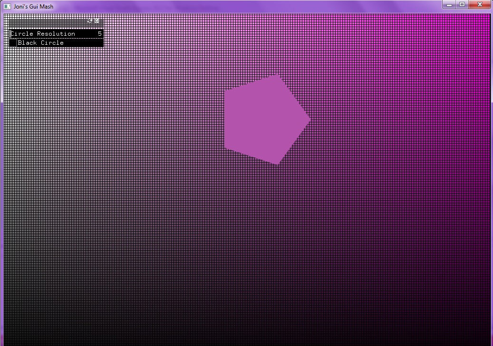
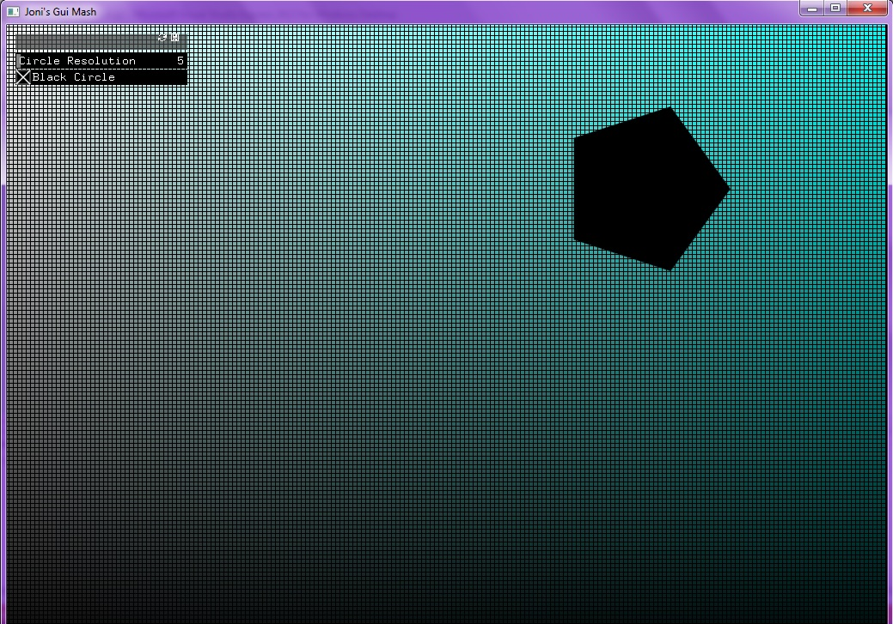
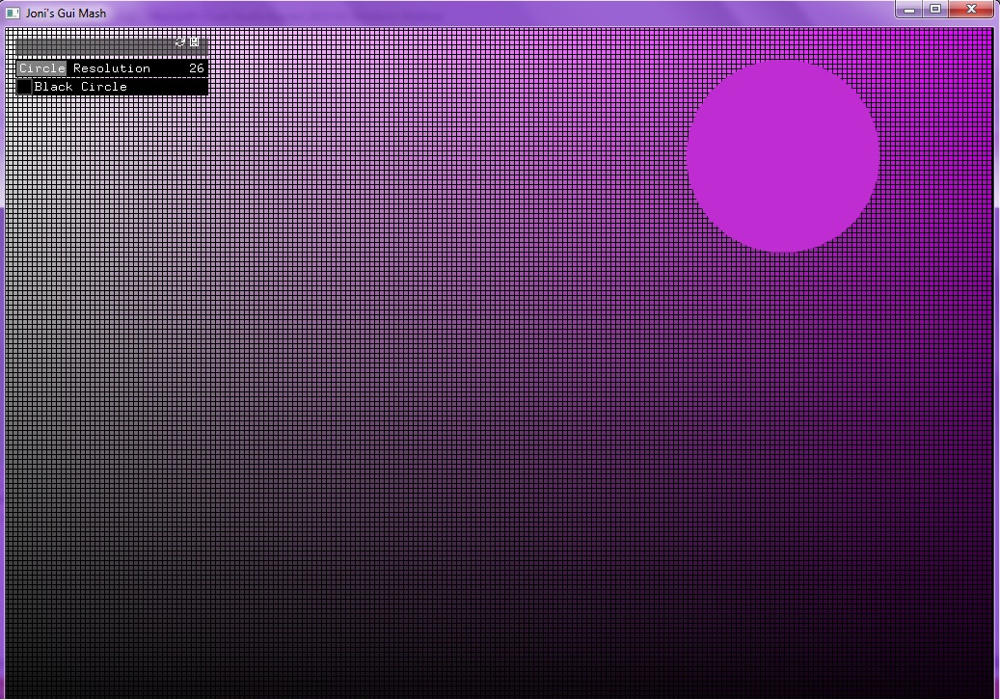

## Joni's GUI Mashup

This app combines the Openframeworks Color Example with its GUI example. It allows the user to change the resolution of the circle following the mouse, and also lets them change the circle to black instead of being filled with the background color. 

This is how the app will look at start up.

In order to make the circle black, press the "Black Circle" button. You must keep your mouse pressed down in order for it to stay black.

In order to change the resolution, move the "Circle Resolution" slider as much as desiered. The lowest you may go is 3, and the highest is 90.

Have fun and enjoy.